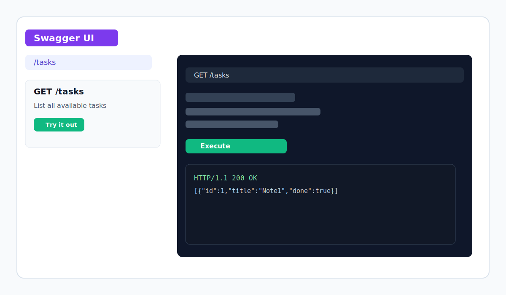

# FlyRank BE01 Task API

This project is a simple Express-based task API with an in-memory task store. It exposes a small set of CRUD-style routes for managing tasks and includes Swagger documentation for browsing the endpoints.

## Install and run

Run the following command from the project folder:

```bash
npm install && node server.js
```

The API will start on port 3000.

## Swagger UI

Open the interactive documentation at:

```text
http://localhost:3000/docs/
```



## Endpoints

| Method | Path | Description |
| --- | --- | --- |
| GET | / | Returns API info |
| GET | /health | Health check |
| GET | /tasks | List all tasks |
| GET | /tasks/{id} | Get one task by ID |
| POST | /tasks | Create a new task |
| PUT | /tasks/{id} | Update a task |
| DELETE | /tasks/{id} | Delete a task |

## Example request

```bash
curl -i http://localhost:3000/health
```

Example response:

```text
HTTP/1.1 200 OK
X-Powered-By: Express
Content-Type: application/json; charset=utf-8
Content-Length: 15

{"status":"ok"}
```

## Notes

- The API uses an in-memory array, so data is reset when the server restarts.
- The OpenAPI definition is stored in [BE01/openapi.json](BE01/openapi.json).

